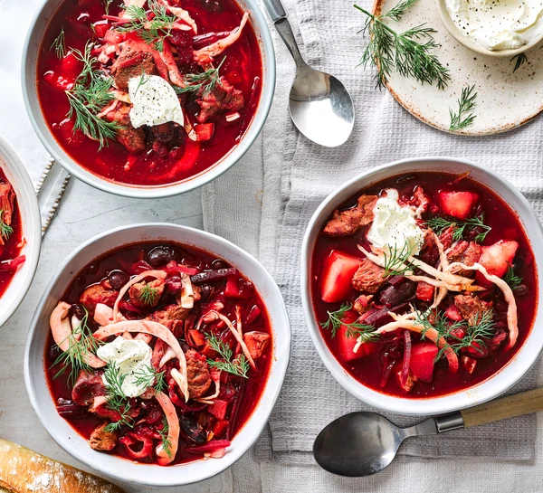
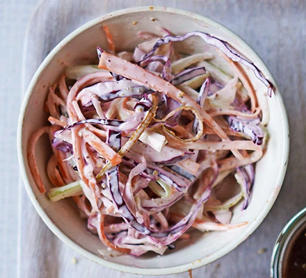
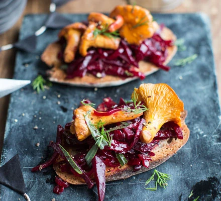
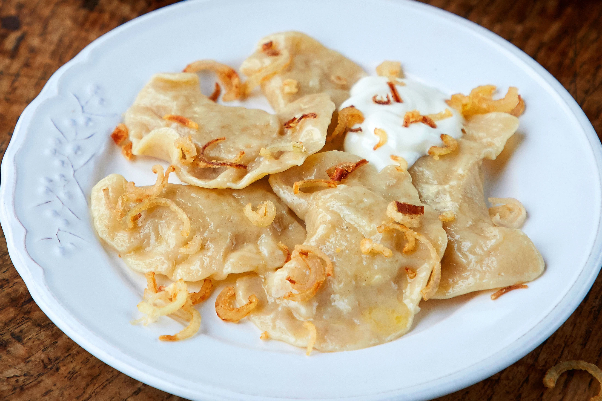

# Ukrainian-Traditional-Cuisine🌿
A simple multi-page website showcasing traditional Ukrainian-inspired recipes.
This project was completed during my college studies at DCFE (Dundrum College of Further Education) as an assignment to strengthen skills in HTML, CSS, and JavaScript.

## 📌 Project Overview
This website presents four traditional Ukrainian-inspired dishes:
- Borscht
- Tangy cabbage slaw
- Shukhi (beetroot & mushroom salad)
- Pierogi
Each dish has its own separate page with an image and description.

## 🖼️ Features
- Multi-page website structure
- Custom CSS3 styling (layout, colors, typography)
- Responsive design basics
- Recipe pages with images and descriptions
- Navigation between pages
- Basic JavaScript animation (typing effect)
- Organized image folder

## 🧰 Technologies Used
- HTML5
- CSS3
- JavaScript (basic DOM manipulation)

  

  
🍲 Borscht

  

  
🥬 Tangy cabbage slaw

  

  
🍄 Shukhi

  

  
🥟 Pierogi

  

